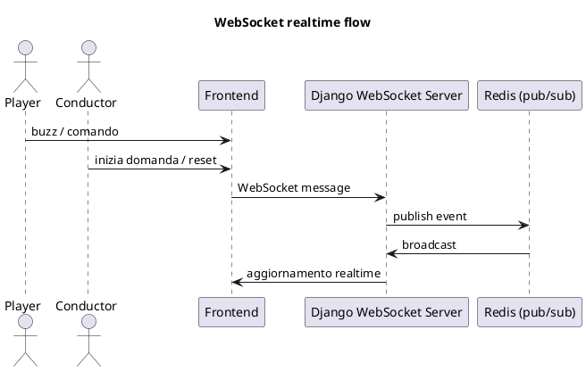

# Arci Quiz: il backend dietro il quiz interattivo

**Ruolo:** Backend Developer  
**Stack:** Django • Docker • PostgreSQL • Redis • Authentik • WebSocket • ESP32

---

## La sfida

Arci Quiz nasce dall’esigenza di creare un quiz a squadre realmente interattivo: pulsanti fisici, stato sincronizzato in tempo reale, timer e punteggi aggiornati istantaneamente.

La difficoltà maggiore è stata coordinare backend, frontend realtime e hardware mantenendo sicurezza, affidabilità e tempi di risposta bassissimi.

---

## Architettura del sistema

```plantuml
@startuml
title Arci Quiz - Architecture Overview

component "Web Client
(Frontend)" as FE
component "Django Backend
(WS + REST)" as BE
component "PostgreSQL" as DB
component "Redis
(pub/sub, cache)" as REDIS
node "ESP32 Devices" as ESP
component "Authentik
(IdP/OAuth2)" as AUTH

FE --> BE : WebSocket + HTTP
BE --> DB : SQL
BE --> REDIS : pub/sub
ESP --> BE : HTTP (POST buzz)
BE --> ESP : HTTP (commands)
FE --> AUTH : OAuth2 login
BE --> AUTH : Token validation

@enduml
```

---

## Il mio contributo

### Architettura containerizzata
- Container Django
- PostgreSQL
- Redis
- Docker Compose

---

### Autenticazione con Authentik
Sistema OAuth2/OIDC con ruoli e token verificati lato backend.

---

### Realtime con WebSocket + Redis



---

### Integrazione ESP32
POST per il buzz, comandi di reset/lock, latenza bassissima.

---

## Risultati
- Backend pronto produzione  
- Realtime stabile  
- Sicurezza avanzata  
- Integrazione hardware ottima  

---

## Next Steps
- Dashboard pubblica live  
- Statistiche quiz  
- Nuovi dispositivi (MQTT/BLE)  
- Modalità torneo

---

Arci Quiz unisce backend, realtime e IoT per un’esperienza immersiva.
